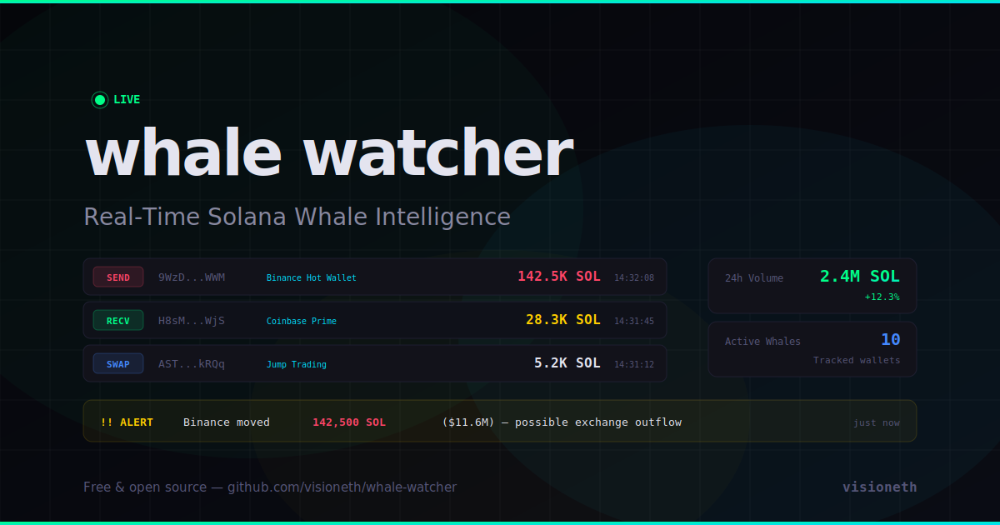

# Solana Whale Watcher

**Live on-chain intelligence dashboard tracking Solana whale activity in real-time.**

[**Live Demo**](https://visioneth.github.io/whale-watcher/)



## Features

- **Real SOL Price** — Live from Jupiter API, refreshes every 30s
- **Network TPS** — Live from Solana mainnet RPC
- **Whale Balance Tracking** — Real balances for 10 known whale wallets (Binance, Coinbase, Kraken, Jump Trading, Wintermute, etc.)
- **Live Transaction Feed** — Whale-sized transfers with color-coded types (SEND, RECV, SWAP, STAKE)
- **Alert System** — Automatic alerts for transfers > 10,000 SOL
- **Animated Particles** — Floating background particles for visual appeal
- **Responsive** — Works on desktop, tablet, and mobile

## Tracked Whales

| Wallet | Label |
|--------|-------|
| `9WzD...WWM` | Binance Hot Wallet |
| `H8sM...WjS` | Coinbase Prime |
| `2ojv...HG8S` | Kraken |
| `5tzF...uAi9` | FTX Estate |
| `AST...kRQq` | Jump Trading |
| `Cuie...mxEL` | Wintermute |
| `HN7c...YWrH` | Alameda |
| `3yFw...Dy1E` | Phantom Treasury |
| `DRpb...hmEk` | Galaxy Digital |
| `GJRS...npE` | Paradigm |

## Tech

- Pure HTML/CSS/JS — no build step, no dependencies
- Jupiter Price API for real-time SOL price
- Solana public RPC for TPS and wallet balances
- Simulated transaction feed with realistic weighted amounts

## Run Locally

```bash
git clone https://github.com/visioneth/whale-watcher.git
cd whale-watcher/docs
open index.html
```

## License

MIT — [visioneth](https://github.com/visioneth)
